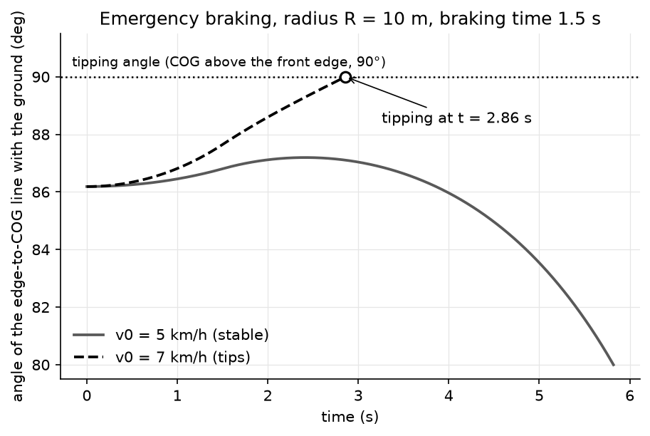
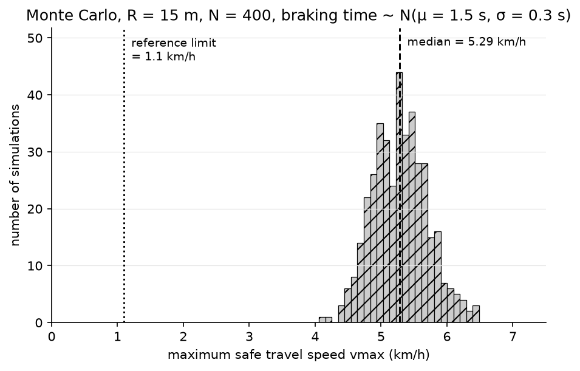

# Crane Stability Model

Dynamic simulation of a crawler crane under emergency braking, used to compute the maximum travel speed the machine can sustain without tipping over.

The model integrates the equations of motion with a fourth-order Runge–Kutta scheme, propagates parameter uncertainty by Monte Carlo simulation, and stores the resulting speed limits in a queryable SQLite database.

---

## Motivation

This work takes **1.1 km/h** as the reference travel-speed limit for crawler cranes, the value commonly associated with the ISO 4305 stability framework. It is used here as a benchmark, not quoted from the standard itself. A single fixed limit of this kind says nothing about how much dynamic headroom a given configuration actually has.

This project reconstructs the braking dynamics explicitly to answer a narrower question: **for a given geometry and load radius, at what speed does tipping actually begin?**

On the synthetic configurations tested, with braking times between 1 and 2 seconds, the simulated limit ranges from **3.5 km/h** at a 20 m radius to **7.0 km/h** at a 10 m radius — three to six times the 1.1 km/h reference. The margin narrows as the load radius grows, which is the expected behaviour: a longer outreach shifts the centre of gravity towards the tipping edge and reduces the restoring moment.

## Method

| Step | Approach |
|---|---|
| Equations of motion | Moment balance about the front tipping edge, inertia modelled as `I_T = m·r²` (`I_G = 0`) |
| Time integration | Fourth-order Runge–Kutta (RK4) |
| Tipping criterion | The centre of gravity passing vertically above the front edge (φ = 90°): `rk4` in `forces.py` flags tipping when the horizontal lever arm `a(φ) = r·cos φ` becomes ≤ 0, and linearly interpolates the crossing time within the time step. A run stops early once φ falls below 80° (the crane is falling back) |
| Speed search | Bisection on travel speed, per configuration |
| Uncertainty propagation | Monte Carlo sampling over the braking time: normal distribution, mean 1.5 s, standard deviation 0.3 s, clipped to [0.5 s, 10 s] |
| Result storage | Per-configuration maximum speed written to SQLite, indexed by radius and braking distance/time |

The same toolchain — ODE integration, Monte Carlo uncertainty propagation, threshold estimation under parameter uncertainty — is method-agnostic and transfers directly to other domains where a limit has to be estimated from a stochastic model.



*Braking trajectory at a 10 m radius with a 1.5 s braking time. At 5 km/h the crane peaks near 87° and falls back; at 7 km/h it crosses the 90° tipping angle (dotted) at t = 2.86 s, marked by the circle.*



*Distribution of the maximum safe speed over 400 draws of the braking time (normal, mean 1.5 s, standard deviation 0.3 s, clipped to [0.5 s, 10 s]) at a 15 m radius. Median 5.29 km/h, with 90% of draws between 4.65 and 5.99 km/h — well above the 1.1 km/h reference limit (dotted).*

## Model parameters

| Symbol | Meaning |
|---|---|
| `x_cog`, `z_cog` | Centre-of-gravity coordinates |
| `radius` | Load outreach |
| `width` | Crane base width |
| `mass_total` | Total system mass (structure + load) |
| `I_T` | Inertia about the tipping edge, `m·r²` |
| `phi_model` | Angle φ (rad) between the ground and the line from the front edge to the centre of gravity: the state variable integrated by RK4, starting at φ₀ = arctan(`z_cog` / (`width`/2 − `x_cog`)), i.e. 86–87° for the configurations tested |

Tipping always occurs at the constant angle φ = 90°, when the centre of gravity is vertically above the front edge; this threshold does not depend on the configuration.

**Conventions.** Moments are counted positive clockwise. The crane travels right to left. The origin is the centre of the base (`width / 2`), and the tipping point is at the front of the machine.

## Project structure

```
.
├── main.py              # Entry point: runs simulations interactively
├── parameters.py        # Crane configuration (COG, masses, geometry)
├── forces.py            # Braking force and RK4 dynamics
├── monte_carlo_sim.py   # Monte Carlo uncertainty propagation
├── create_database.py   # Computes vmax per configuration into SQLite
├── make_figures.py      # Regenerates figures/: braking trajectory, Monte Carlo histogram
├── plotting.py          # Plots for main.py: angle vs time, max angle vs speed,
│                        #   vmax vs radius, vmax vs braking distance (from SQLite)
├── crane_vmax.sqlite    # Generated results database (regenerable)
├── figures/             # README figures, generated by make_figures.py
├── requirements.txt     # Python dependencies
├── LICENSE              # MIT
└── README.md
```

`create_database.py` writes two tables: `analysis`, indexed by braking distance `s_brake`, and `analysis_time`, indexed by braking time `t_brake`.

## Installation

Requires Python 3.9 or later.

```bash
git clone https://github.com/enzomotoyama/crane-stability-model.git
cd crane-stability-model
pip install -r requirements.txt
```

Dependencies: NumPy, Pandas, Matplotlib. SQLite is part of the standard library.

## Usage

Run a simulation from the interactive entry point:

```bash
python main.py
```

Regenerate the results database across all configurations (about 9 minutes):

```bash
python create_database.py
```

Regenerate the figures (about 4.5 minutes, almost all of it spent on the Monte Carlo):

```bash
python make_figures.py
```

### Sample output

```
i=0, R=10.0 m, t_brake=1.0 : vmax=1.517 m/s (5.46 km/h)
i=0, R=10.0 m, t_brake=1.5 : vmax=1.724 m/s (6.20 km/h)
i=0, R=10.0 m, t_brake=2.0 : vmax=1.947 m/s (7.01 km/h)
...
i=10, R=20.0 m, t_brake=2.0 : vmax=1.293 m/s (4.66 km/h)
```

The maximum safe speed rises with the available braking time and falls as the load radius increases.

## Data and confidentiality

This work was inspired by engineering carried out during an internship at **Tadano Europe (R&D department)**. No proprietary data is included in this repository.

**Every numerical value in the code — centre of gravity, radii, masses, geometry — is synthetic and anonymised.** The results are therefore illustrative of the method, not of any real machine.

## Limitations

- Rigid-body model: structural flexibility and ground compliance are not represented.
- Inertia about the centre of gravity is neglected (`I_G = 0`).
- Planar model — no lateral dynamics, slope, or wind loading.
- Braking force is modelled as a simplified deceleration profile.

**This tool must not be used for crane certification or for operational decisions.** It is an academic and research exercise.

## License

MIT
